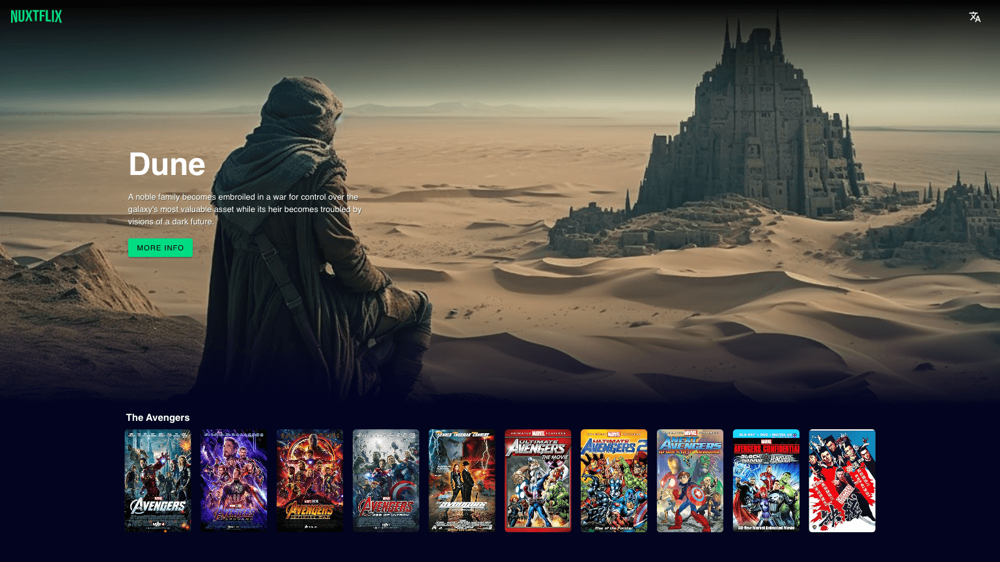

# Nuxtflix

 A movie app for videoclub users to log in and access a selection of films and their attributes.



## Setup

Make sure to install the dependencies:

```bash
# npm
npm install
```

Configure .env file
```
OMDB_API_KEY=
```
Get your OMDB_API_KEY on the [omdb website](https://omdbapi.com/apikey.aspx).


## Development Server

Start the development server on `http://localhost:3000`:

```bash
# npm
npm run dev
```

## Production

Build the application for production:

```bash
# npm
npm run build
```

Locally preview production build:

```bash
# npm
npm run preview
```